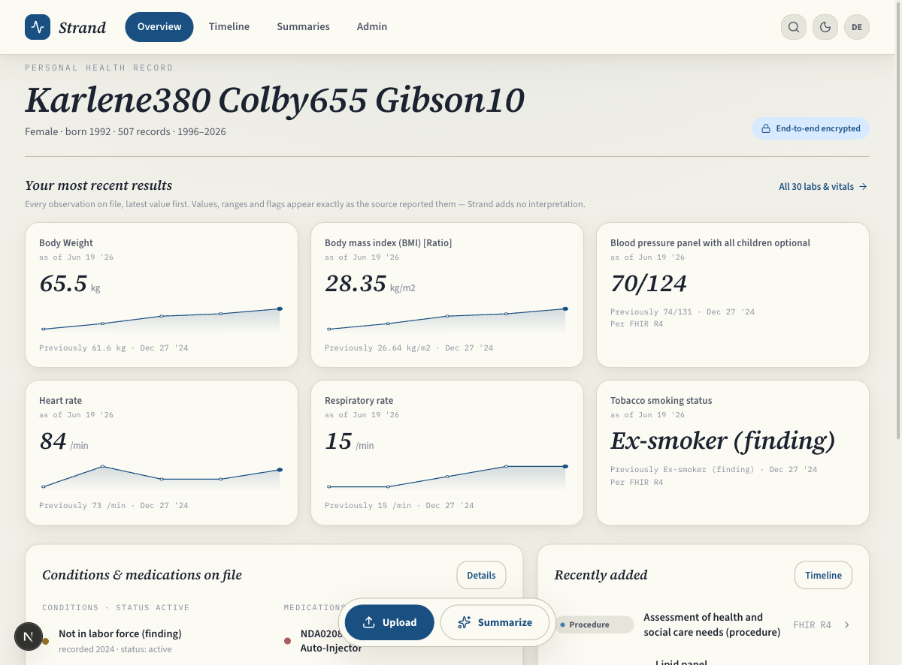
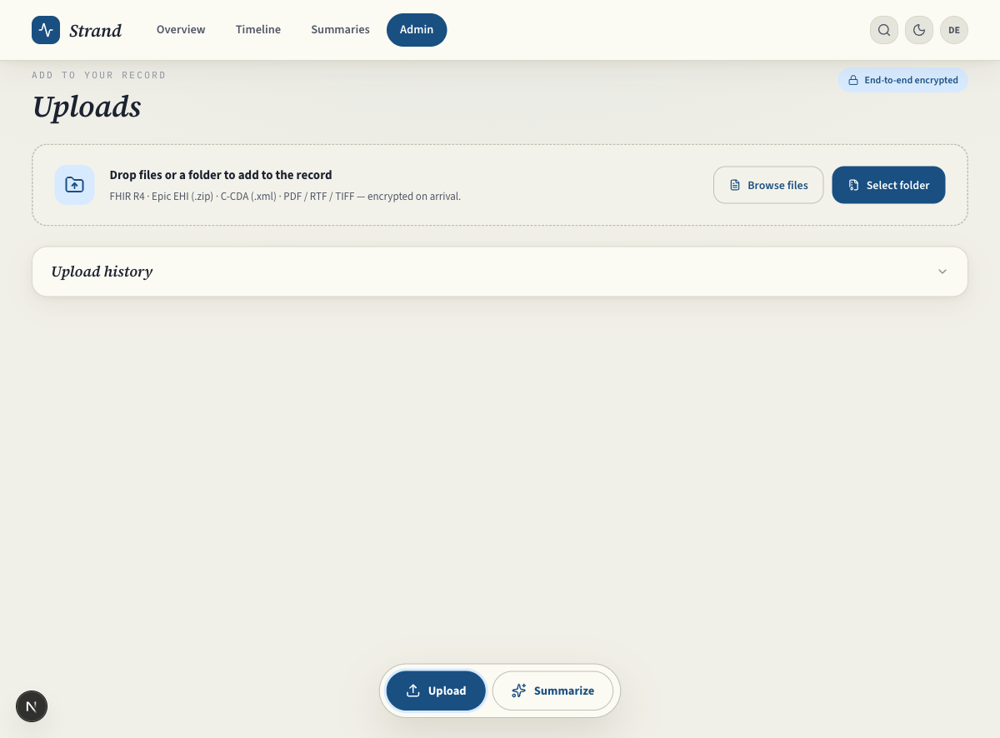
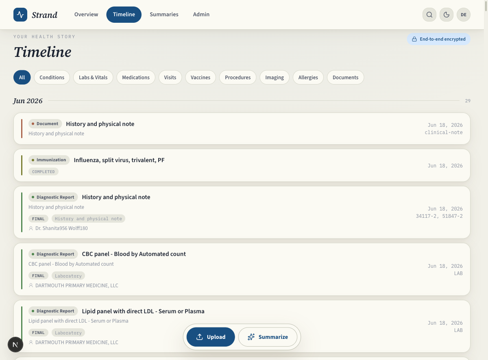
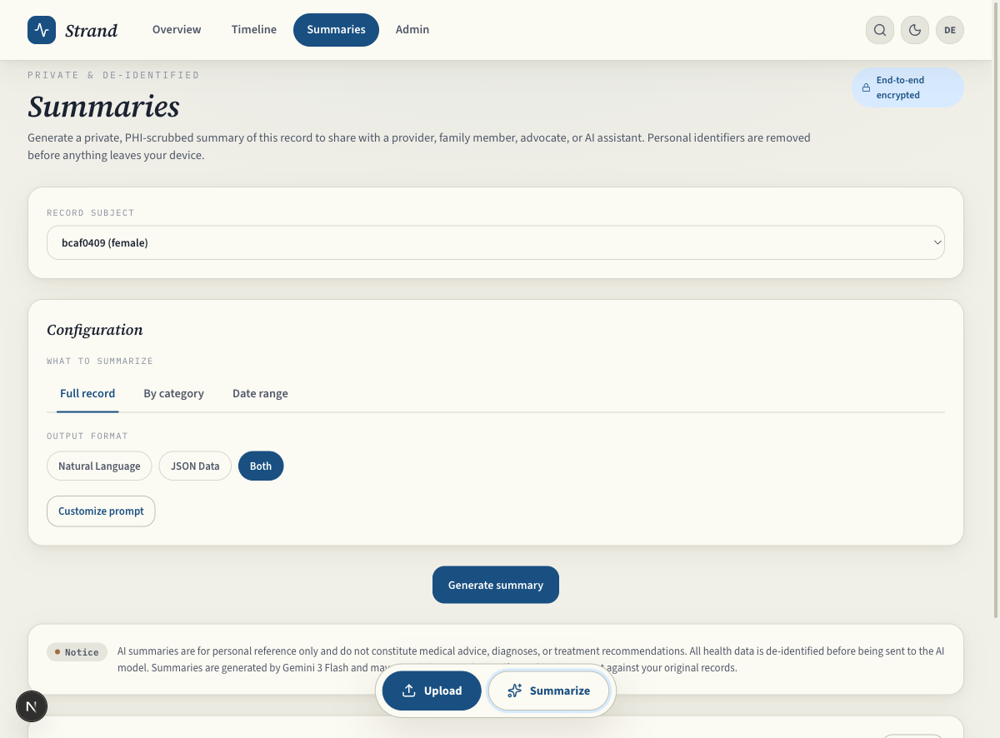
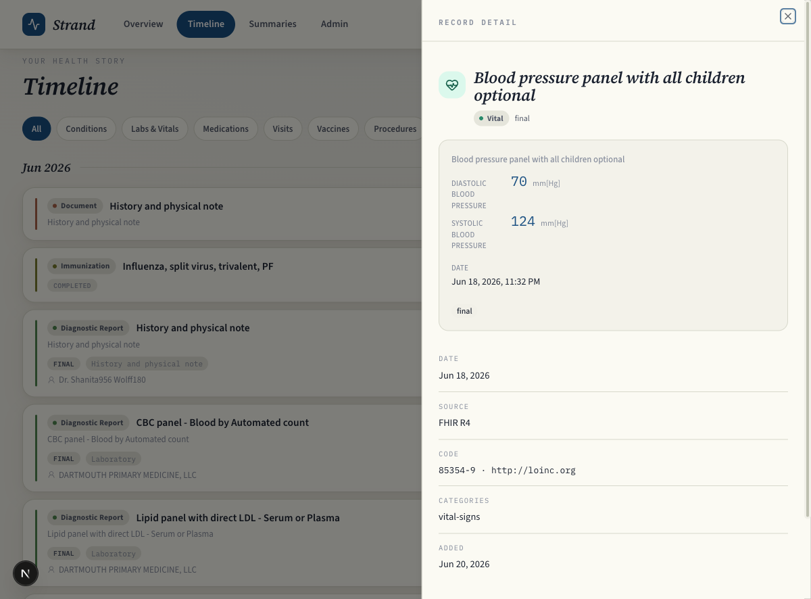
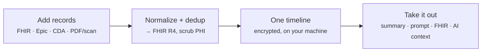
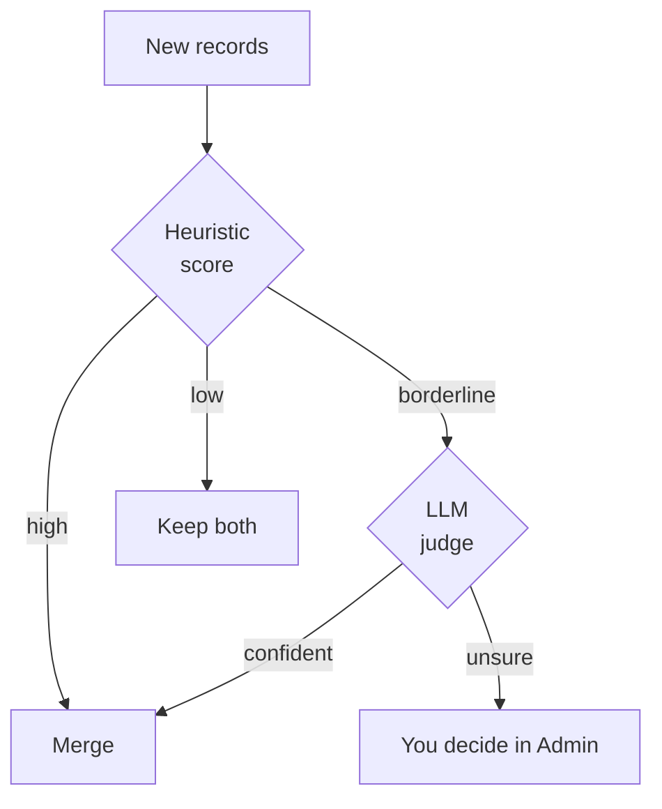
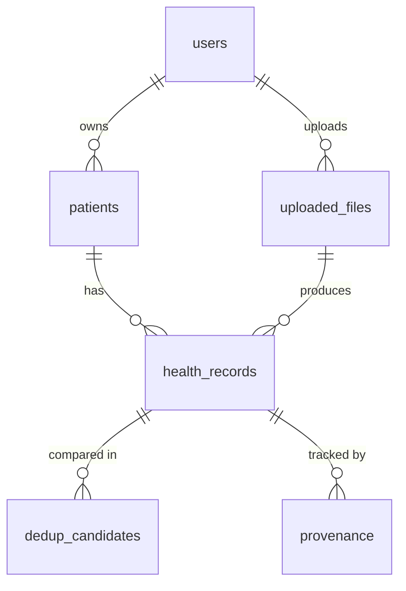

# Strand

**Every medical record you have, in any format, on one timeline — then out as a summary, a prompt, a FHIR export, or context for the AI of your choice.**

[](LICENSE)
[](#tests)
[](#quick-start-docker)


*Your records at a glance. All screenshots use synthetic [Synthea](https://synthetichealth.github.io/synthea/) data — no real records.*

Your medical history arrives scattered across formats and portals: a FHIR bundle from one system, an Epic EHI export from another, a CDA document from the hospital, a scanned PDF from the specialist who still faxes. Strand ingests all of it — structured exports and unstructured documents alike, reading scans and notes into structured records with optional AI — normalizes everything to FHIR R4, removes the duplicates that pile up across exports, and lays it out on one interactive timeline.

Then it's yours to use. Strand can write you a summary, hand you a de-identified prompt to paste into any LLM, export a standard FHIR bundle for another system, or give you clean context to drop into the AI of your choice. The AI is optional and privacy-preserving: every record is de-identified before it reaches a model, and a prompt-only mode sends nothing anywhere. Strand organizes and moves your records; it does not diagnose, interpret, or give medical advice.

## A quick tour

| | |
|---|---|
|  |  |
| **In:** add records in any format — FHIR, Epic, CDA, or a scanned PDF. | **Organized:** everything on one timeline, de-duplicated and coded. |
|  |  |
| **Out:** a de-identified summary, prompt, or FHIR export. | A record opened up, with its values, coding, and source. |

## Quick start (Docker)

You need Docker (Desktop, or Engine + Compose).

```bash
git clone https://github.com/potalora/strand && cd strand
cp .env.docker.example .env
just gen-secrets            # or: bash scripts/gen-secrets.sh
docker compose up -d        # or: just up
```

Then open http://localhost:3000 (the API is at http://localhost:8000). For live AI features, add a provider key (Gemini, OpenAI, Anthropic, or OpenRouter) or point at a local Ollama or LM Studio model — set this up in the app at Admin → AI providers, or see the [AI providers](#ai-providers) section. The prompt-only path needs no key at all.

Everything binds to `127.0.0.1`, so nothing is reachable from outside your machine. On-device clinical extraction is off by default to keep the image small; rebuild with `--build-arg CLINICAL_NLP=true` to turn it on. To upgrade, bump `APP_VERSION` in `.env` and run `docker compose pull && docker compose up -d`.

## What it does



Records go in as whatever you have. They come out as whatever you need.

## What goes in

Structured exports and unstructured documents go in the same way: Strand parses what it can, reads what it can't (scanned PDFs and notes) into structured records, codes them against standard vocabularies, de-duplicates against what you already have, and normalizes everything to FHIR R4.

| Format | File type | What it produces |
|--------|-----------|------------------|
| FHIR R4 bundle | `.json` | 18 resource types |
| Epic EHI Tables | `.zip` of `.tsv` | 14 table mappers → FHIR |
| CDA XML | `.xml` | ClinicalDocument → FHIR |
| IHE XDM | `.zip` | manifest → CDA docs → FHIR |
| Unstructured | `.pdf` `.rtf` `.tiff` | OCR → entity extraction → FHIR |

<details>
<summary>Epic EHI table mappers (14) and FHIR resource types (18)</summary>

**Epic TSV → FHIR:** PROBLEM_LIST / PROBLEM_LIST_ALL / MEDICAL_HX → Condition · PAT_ENC_DX → Condition (encounter dx) · ORDER_MED → MedicationRequest · ORDER_RESULTS → Observation · IP_FLWSHT_MEAS → Observation (vitals) · SOCIAL_HX → Observation (social) · PAT_ENC → Encounter · DOC_INFORMATION → DocumentReference · ALLERGY → AllergyIntolerance · IMMUNE → Immunization · ORDER_PROC → Procedure · REFERRAL → ServiceRequest · FAMILY_HX → FamilyMemberHistory

**FHIR resource types:** Condition, Observation, MedicationRequest, MedicationStatement, AllergyIntolerance, Procedure, Encounter, Immunization, DiagnosticReport, DocumentReference, ImagingStudy, ServiceRequest, CarePlan, Communication, Appointment, CareTeam, ImmunizationRecommendation, QuestionnaireResponse

</details>

## What comes out

Getting records out matters as much as getting them in. From your records you can produce:

- **A summary** — Strand writes it for you in live AI mode, using whichever model you pick: Gemini, Claude, an OpenAI model, or one running locally.
- **A copy-paste prompt** — a de-identified prompt, ready to run in any LLM, no API key needed.
- **A FHIR R4 bundle** — a standard export for any other app or system.
- **De-identified context** — the scrubbed records themselves, to drop into the AI chat of your choice.

Anything that involves a model is de-identified first; the prompt and context paths never call one at all.

## Privacy and AI

- **AI is optional, and off the critical path.** Prompt-only mode builds a prompt you run yourself and sends nothing anywhere. Live mode calls a model directly, and de-identifies every record first.
- **De-identification runs before every model call**, in three layers: regex identifiers, your own known identifiers (name, MRN, DOB), and a spaCy name model for the free-text names patterns miss.
- **No medical advice.** Strand organizes, summarizes, and exports records. It never generates diagnoses, interpretations, or treatment suggestions.
- **It runs on your machine.** The stack is self-hosted and binds to `127.0.0.1`, so nothing is exposed by default.
- **Honest about limits.** Some things still slip through the scrubber (city names, for one), and there's no auto-update — with health data, you decide when to move to a new version.

## AI providers

Strand isn't tied to one model. Add a key for whichever provider you want, or run entirely on your own machine, and pick which one handles each task. You manage providers in the app at **Admin → System → AI providers**: paste a key, choose a model, test the connection. Keys are encrypted and stored only on your server.

| Provider | How to use | Runs |
|----------|------------|------|
| Google Gemini | API key | Cloud |
| OpenAI | API key | Cloud |
| Anthropic (Claude) | API key | Cloud |
| OpenRouter | API key | Cloud (aggregator) |
| Ollama | local server, no key | On your machine |
| LM Studio | local server, no key | On your machine |
| Vertex AI | Google Cloud project | Cloud |

Any OpenAI-compatible endpoint works through the OpenAI option — just point it at the base URL. You can route each task to a different provider (say, a local model for document extraction and a cloud model for summaries), and if one provider declines a scanned document during OCR, Strand falls back to the next one you've configured. Cloud providers only ever receive de-identified records; local models keep everything on your machine.

## How it works

### De-duplication

The same hypertension diagnosis shows up in an Epic export and again in a CDA document with slightly different wording. So every upload runs a two-tier scan against what's already stored: a cheap heuristic scorer first, then an LLM judge — whichever provider you've configured — only for the ambiguous middle.



Score ≥ 0.95 merges on its own; 0.50–0.94 goes to the judge (which auto-resolves at ≥ 0.8 confidence); below that is left alone. Every merge keeps the originals and is reversible.

### Extraction from documents

A scanned note becomes structured records through OCR, then entity extraction (medications, conditions, procedures, labs, vitals, allergies, providers). Extraction runs one of three ways, set by `EXTRACTION_ENGINE`: `gemini` (the cloud path — routed to whichever provider you've configured, not just Gemini), `local` (on-device clinical NLP — medspaCy and scispaCy, nothing leaves the machine), or `hybrid`, the default, which runs local first and sends only the sections it's unsure about to the cloud. Local and hybrid need the optional `clinical-nlp` extra; without it, extraction falls back to the cloud path on its own. OCR itself goes through whichever vision provider you've picked, with automatic fallback if one declines a document.

### Coding and cleanup

As records come in, Strand attaches standard codes where it can: RxNorm for medications, ICD-10-CM for conditions, LOINC for common labs. The vocabularies are bundled and matched locally, so no terminology lookups leave your machine, and a fuzzy match (RapidFuzz, on a tight threshold) catches typos and brand/generic variants without risking a wrong code. Anything it doesn't recognize stays uncoded rather than guessed. Extraction also drops obvious noise before anything is stored — bare measurements, procedures only mentioned in passing, scrubber leftovers — so the timeline is made of real records, not fragments.

## Architecture and data



`health_records` is the core table: every clinical fact, stored as FHIR R4 JSONB. UUID primary keys everywhere; PII encrypted at rest with AES-256/pgcrypto. Nothing is hard-deleted: `deleted_at` marks a row gone, and deleting an upload cascades that soft-delete to the records it produced. Full schema lives in the Alembic migrations.

## Configuration

Copy `.env.docker.example` to `.env` and run `just gen-secrets` to fill the required secrets (`DB_PASSWORD`, `JWT_SECRET_KEY`, `DATABASE_ENCRYPTION_KEY`). An AI provider key is optional (live AI mode) — add one in the app or via `.env`. See `.env.example` for the full list.

## Develop

`just` wraps the dev loop. `just setup` provisions the toolchain (uv for the backend, npm for the frontend) and brings up Postgres and Redis in Docker; `just dev` runs both servers with reload; `just test` runs the suites.

<details>
<summary>Native setup without Docker (macOS)</summary>

```bash
brew services start postgresql@16 && brew services start redis
createdb strand && createdb strand_test
psql strand < scripts/init-db.sql
psql strand_test -c "CREATE EXTENSION IF NOT EXISTS pgcrypto;"

cd backend && uv sync && uv run python -m spacy download en_core_web_md
uv run alembic upgrade head
uv run uvicorn app.main:app --reload --port 8000

cd frontend && npm install && npm run dev
```

</details>

## Tests

```bash
cd backend
uv run pytest -m "not slow"     # fast suite
uv run pytest                    # everything (slow tests call a live AI provider)
uv run pytest tests/fidelity/    # real-data fidelity (skips without fixtures)
```

The fast suite runs against `strand_test` (auto-derived from `DATABASE_URL`). Fidelity tests need real-data fixtures and skip when they're absent; point `REAL_MEDICAL_FIXTURES_DIR` at a local corpus to run them.

## API

Full contract: [`docs/backend-handoff.md`](docs/backend-handoff.md) (base URL `/api/v1`).

| Group | Endpoints |
|-------|-----------|
| **Auth** | `register` `login` `refresh` `logout` `me` |
| **Records** | `GET /records` · `/records/:id` · `/records/:id/linked` · `/search` · `/series` · `/export` |
| **Timeline** | `GET /timeline` |
| **Upload** | `POST /upload` · `/upload/unstructured` · status + review endpoints |
| **Dedup** | `/dedup/candidates` · `/merge` · `/dismiss` |
| **Summary & export** | `/summary/build-prompt` · `/generate` · `/paste-response` · `GET /records/export` |

## Security and HIPAA controls

| Authentication | Data protection | Monitoring |
|----------------|-----------------|------------|
| bcrypt (cost 12+) | AES-256 at rest | Audit log on all data endpoints |
| JWT 15-min access tokens | PHI scrub before any AI call | Rate limiting |
| 7-day refresh tokens (rotated) | Soft delete only | Account lockout (5 fails) |
| Token revocation (JTI) | User-scoped queries | 30-min idle timeout |
| Password complexity | UUID upload filenames | CORS hardening |

Strand is built to be HIPAA-minded for self-hosting; a single-user, self-hosted instance is not a covered entity, and "HIPAA controls" here describes the safeguards in the code, not a certification.

## Tech stack

**Backend** — Python 3.11 / FastAPI / SQLAlchemy 2 async / PostgreSQL 16 / Alembic / LangExtract / spaCy / RapidFuzz / `fhir.resources`. Pluggable LLM layer over the Gemini, OpenAI, and Anthropic SDKs (one OpenAI-compatible client also covers OpenRouter, Ollama, and LM Studio). Optional `clinical-nlp` extra adds scispaCy + medspaCy for on-device extraction (no PyTorch).

**Frontend** — Next.js / TypeScript / Tailwind CSS / shadcn/ui / TanStack Query / Zustand. Custom JWT auth with transparent refresh.

**Infra** — PostgreSQL 16 + Redis 7, via Docker Compose or Homebrew. Container images published to GHCR (`:edge` on every merge, `:vX.Y.Z` on release tags).

## License

[MIT](LICENSE)
