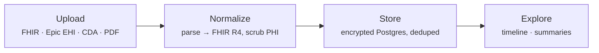
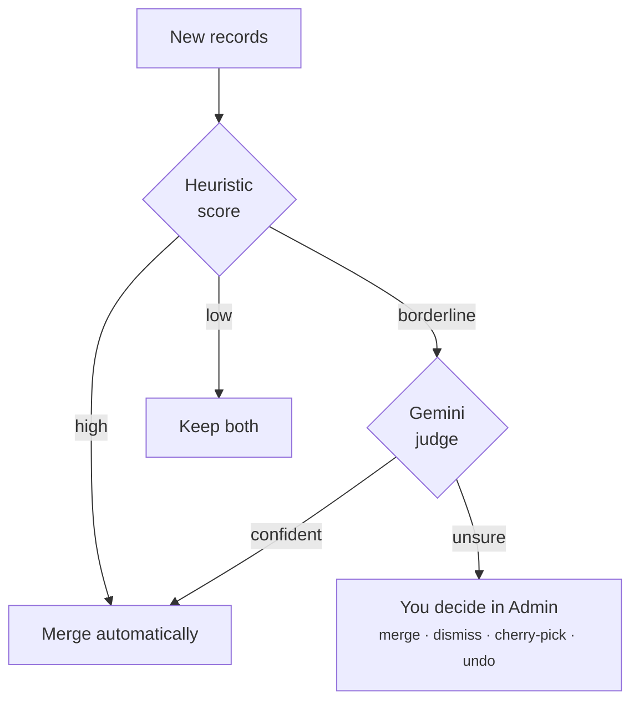
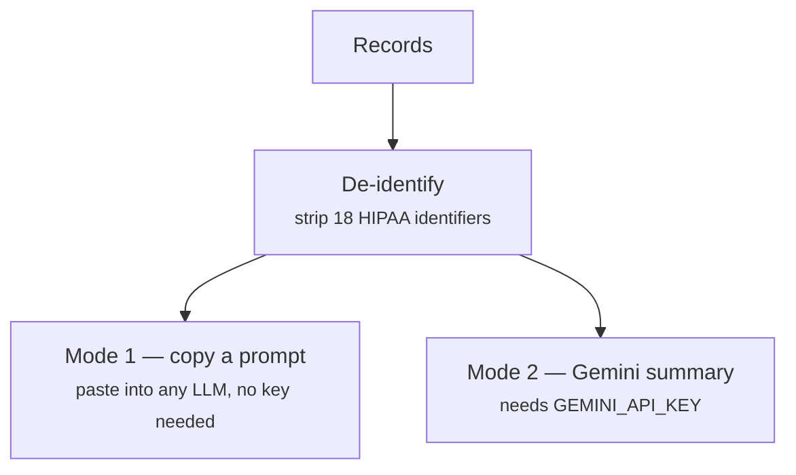
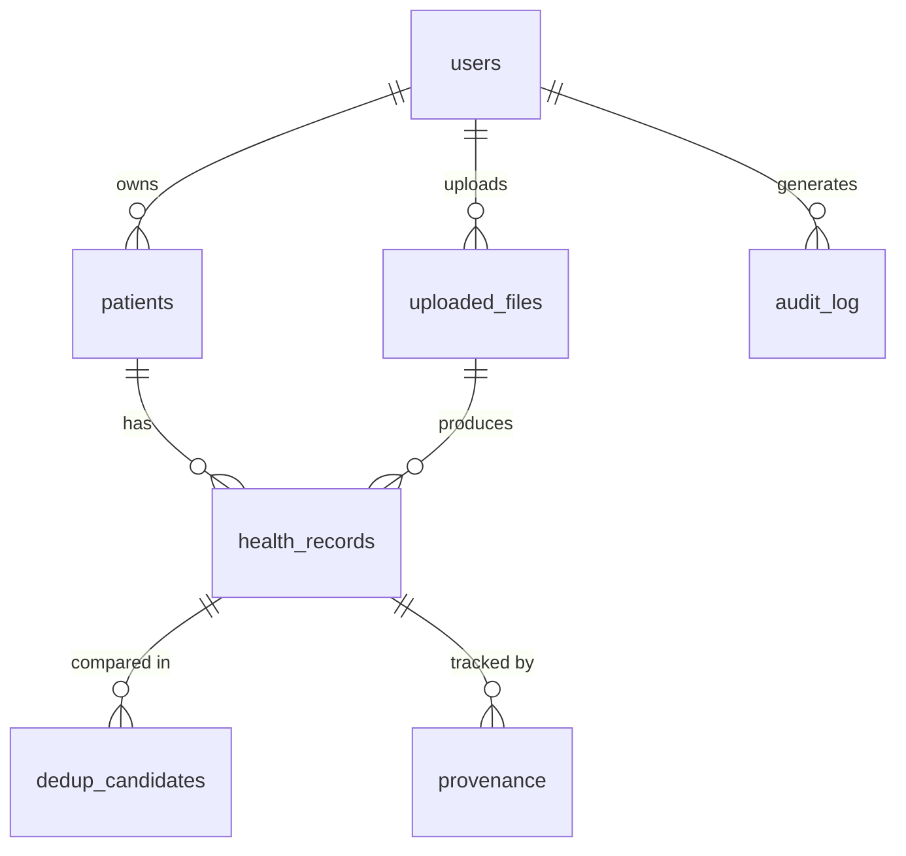

# MedTimeline

Your medical records come scattered across formats and portals: a FHIR bundle from one system, an Epic EHI export from another, a CDA document from the hospital, a scanned PDF from the specialist who still faxes. MedTimeline ingests all of it, normalizes everything to FHIR R4 in a local PostgreSQL database, and lays it out on one timeline.

It's local-first: your data stays on your machine. AI summaries are optional — prompt-only mode sends nothing anywhere, and live mode de-identifies every record before it reaches the API.

## How data flows



The formats and parsers behind that "Normalize" step are in [Ingestion formats](#ingestion-formats) below.

## Dedup pipeline

Records overlap. The same hypertension diagnosis shows up in an Epic export and again in a CDA document with slightly different wording. So every upload runs a two-tier dedup scan against what's already stored: a cheap heuristic scorer first, then a Gemini judge only for the ambiguous middle.



**Heuristic scoring weights:**

| Signal | Weight |
|--------|--------|
| `code_value` match | 0.40 |
| `display_text` similarity | 0.30 |
| `effective_date` proximity | 0.20 |
| `status` match | 0.10 |
| Cross-source bonus | 0.10 |
| `source_section` match | 0.15 |

Score ≥ 0.95 merges automatically; 0.50–0.94 goes to the Gemini judge (which auto-resolves at ≥ 0.8 confidence); below 0.50 is left alone.

## Ingestion formats

| Format | File type | What it produces |
|--------|-----------|------------------|
| FHIR R4 Bundle | `.json` | 18 resource types → health_records |
| Epic EHI Tables | `.zip` of `.tsv` | 14 table mappers → FHIR resources |
| CDA XML | `.xml` | ClinicalDocument → FHIR via converter |
| IHE XDM | `.zip` | METADATA.XML manifest → CDA docs → FHIR |
| Unstructured | `.pdf` `.rtf` `.tiff` | Gemini OCR → entity extraction → FHIR |

<details>
<summary>Epic EHI table mappers (14)</summary>

| Epic TSV table(s) | FHIR resource |
|-------------------|---------------|
| PROBLEM_LIST, PROBLEM_LIST_ALL, MEDICAL_HX | Condition |
| PAT_ENC_DX | Condition (encounter diagnosis) |
| ORDER_MED | MedicationRequest |
| ORDER_RESULTS | Observation |
| IP_FLWSHT_MEAS | Observation (vital signs) |
| SOCIAL_HX | Observation (social history) |
| PAT_ENC | Encounter |
| DOC_INFORMATION | DocumentReference |
| ALLERGY | AllergyIntolerance |
| IMMUNE | Immunization |
| ORDER_PROC | Procedure |
| REFERRAL | ServiceRequest |
| FAMILY_HX | FamilyMemberHistory |

</details>

<details>
<summary>FHIR resource types (18)</summary>

Condition, Observation, MedicationRequest, MedicationStatement, AllergyIntolerance, Procedure, Encounter, Immunization, DiagnosticReport, DocumentReference, ImagingStudy, ServiceRequest, CarePlan, Communication, Appointment, CareTeam, ImmunizationRecommendation, QuestionnaireResponse

</details>

## AI modes

MedTimeline organizes records and produces summaries. It never diagnoses, recommends treatment, or gives medical advice — and either way, records are de-identified before any model sees them. There are two ways to run it:



The scrubber runs in three layers: regex patterns for the structured identifiers (SSN, MRN, phone, dates, addresses), a known-patient pass that redacts the record owner's own name and DOB, and spaCy NER to catch provider and family names the patterns miss.

**Summary types:** full, category, date range, single record
**Model:** `gemini-3.5-flash` (summaries, OCR, and entity extraction)

## Database



`health_records` is the core table — every clinical fact, stored as FHIR R4 JSONB. Every table uses UUID primary keys and `created_at`/`updated_at` timestamps; PII is encrypted at rest with AES-256/pgcrypto. Nothing is ever hard-deleted: `deleted_at` marks a row gone, and deleting an upload cascades that soft-delete to the records it produced. Full column-level schema lives in the Alembic migrations.

## HIPAA controls

| Authentication | Data protection | Monitoring |
|----------------|-----------------|------------|
| bcrypt (cost 12+) | AES-256 at rest | Audit log on all data endpoints |
| JWT 15-min access tokens | PHI scrub before any AI call | Rate limiting |
| 7-day refresh tokens (rotated) | Soft delete only | Account lockout (5 fails) |
| Token revocation (JTI blacklist) | User-scoped queries | 30-min idle timeout |
| Password complexity enforcement | UUID upload filenames | CORS hardening |
| HSTS + CSP + security headers | No PII in error responses | |

## Tech stack

**Backend**: Python 3.12 / FastAPI / SQLAlchemy 2 async / PostgreSQL 16 / Alembic / Gemini API / LangExtract / spaCy (PHI NER) / python-fhir-converter

**Frontend**: Next.js 15 / TypeScript / Tailwind CSS 4 / shadcn/ui / TanStack Query / Zustand. Auth is custom JWT — access + rotated refresh tokens in a Zustand store, with transparent 401 refresh in `lib/api.ts` (no auth framework).

**Infra**: PostgreSQL 16 + Redis 7 via Homebrew, macOS. No Docker.

## Project structure

```
backend/
├── app/
│   ├── main.py, config.py, database.py
│   ├── middleware/          # auth, audit, encryption, security headers, rate limit
│   ├── models/              # user, patient, record, uploaded_file, ai_summary, dedup, provenance, audit
│   ├── api/                 # auth, records, timeline, upload, summary, dedup, review, dashboard, audit
│   └── services/
│       ├── ingestion/       # coordinator, fhir_parser, epic_parser, cda_parser, xdm_parser,
│       │                    # cda_dedup, bulk_inserter, epic_mappers/ (14)
│       ├── ai/              # prompt_builder, summarizer, phi_scrubber, patient_phi, phi_ner
│       ├── extraction/      # text_extractor, entity_extractor, section_parser, entity_to_fhir
│       └── dedup/           # detector, orchestrator, llm_judge, field_merger
├── tests/                   # ~57 files, ~697 tests
└── alembic/                 # migrations

frontend/src/
├── app/(dashboard)/         # overview, timeline, upload (+review), summaries, admin (4-tab), records/[id]
├── components/retro/        # 18 components — Reimagined theme (Bloom / Prussian / Editorial)
└── lib/                     # api.ts, utils.ts, constants.ts
```

The frontend theme is "Reimagined": warm paper, a deep ink-blue (Prussian) accent, and an italic serif display face (Source Serif 4 × Source Sans 3 × IBM Plex Mono). It reads as a records organizer, not a dashboard — values are shown neutrally, with no good/bad coloring.

## Setup

```bash
# 1. infra
brew services start postgresql@16 && brew services start redis
createdb medtimeline && createdb medtimeline_test
psql medtimeline < scripts/init-db.sql
psql medtimeline_test -c "CREATE EXTENSION IF NOT EXISTS pgcrypto;"

# 2. env
cp .env.example .env
# edit: DATABASE_ENCRYPTION_KEY, JWT_SECRET_KEY
# optional: GEMINI_API_KEY (for live AI features)

# 3. backend
cd backend && pip install -e ".[dev]"
alembic upgrade head
DATABASE_URL=postgresql+asyncpg://localhost:5432/medtimeline_test alembic upgrade head
uvicorn app.main:app --reload --port 8000

# 4. frontend
cd frontend && npm install && npm run dev
# open http://localhost:3000
```

## Tests

```bash
cd backend
python -m pytest -m "not slow"        # 681 fast tests
python -m pytest --run-slow            # all 697 (16 slow need GEMINI_API_KEY + real data)
python -m pytest tests/test_hipaa_compliance.py
python -m pytest tests/fidelity/       # Epic / FHIR / CDA fidelity (skip without real fixtures)
```

697 tests across 57 files. They run against `medtimeline_test`, auto-derived from `DATABASE_URL`. The slow ones call the real Gemini API; fidelity tests need real-data fixtures and skip when those are absent. A 120s per-test timeout backstops hangs in the fast suite; slow tests get a longer bound.

## API

Full contract: [`docs/backend-handoff.md`](docs/backend-handoff.md)

| Group | Endpoints |
|-------|-----------|
| **Auth** | `POST /auth/register` `/login` `/refresh` `/logout` `GET /auth/me` |
| **Records** | `GET /records` (`?status=` `?sort=` `?order=`) `/records/:id` `/records/search` `/records/series` `/records/export` `DELETE /records/:id` |
| **Timeline** | `GET /timeline` |
| **Dashboard** | `GET /dashboard/overview` `/labs` `/patients` `/sources` |
| **Upload** | `POST /upload` `/upload/unstructured` `/unstructured-batch` `/trigger-extraction` `DELETE /upload/:id` |
| **Upload status** | `GET /upload/:id/status` `/errors` `/extraction` `/history` `/pending-extraction` `/extraction-progress` |
| **Upload review** | `POST /upload/:id/confirm-extraction` `GET /upload/:id/review` `POST /review/resolve` `/undo-merge` |
| **Dedup** | `GET /dedup/candidates` `POST /dedup/merge` `/dismiss` |
| **AI Summary** | `POST /summary/build-prompt` `/generate` `/paste-response` `GET /summary/prompts` `/prompts/:id` `/responses` |
| **Audit** | `GET /audit-log` |

## License

[MIT](LICENSE)
