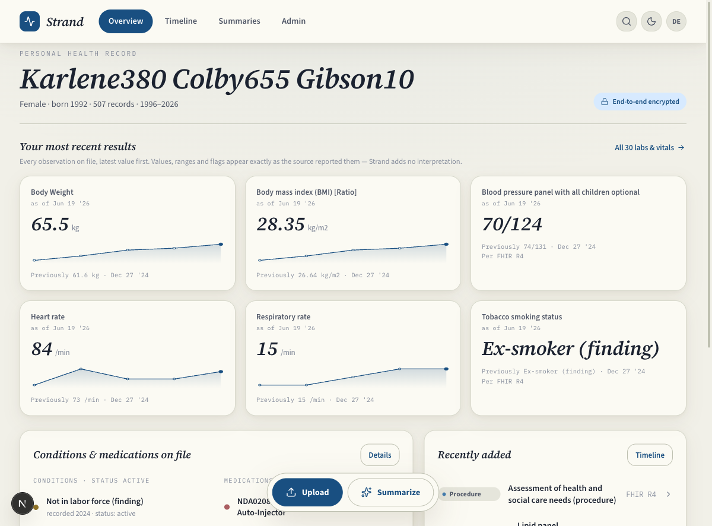
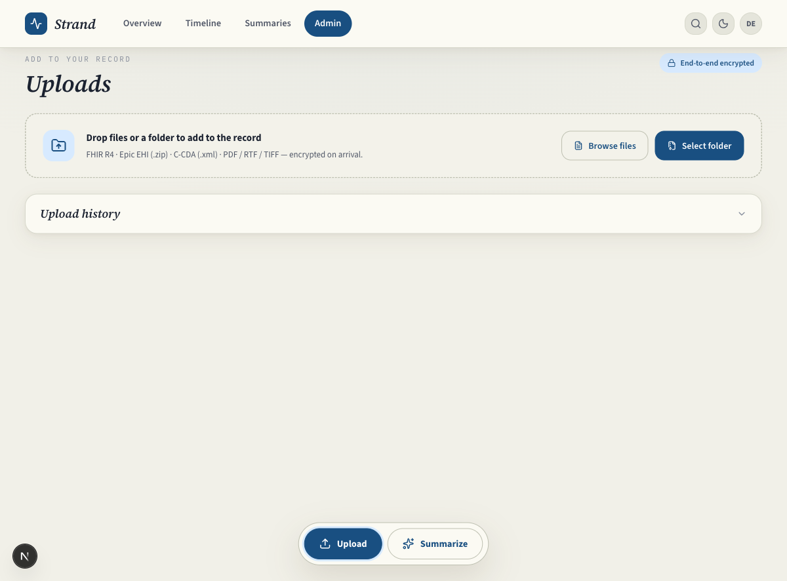
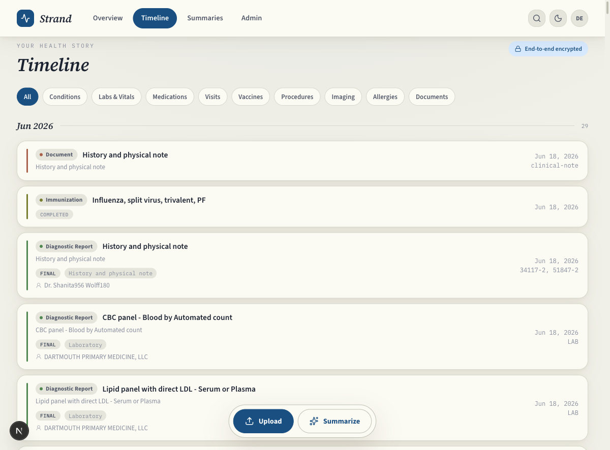
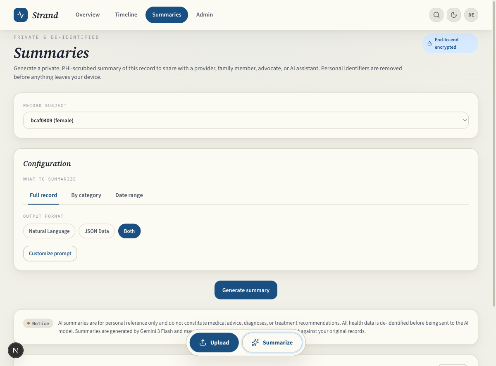
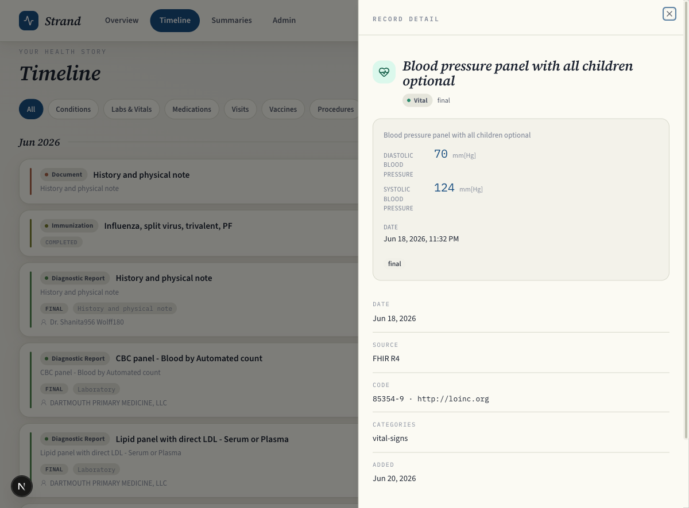
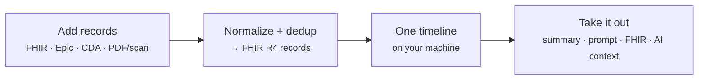
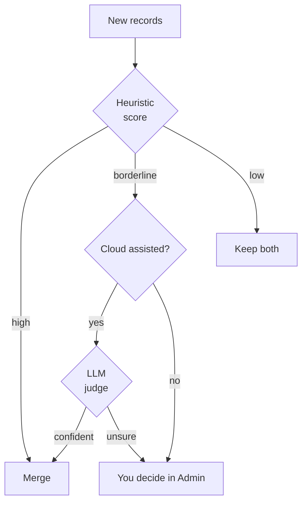
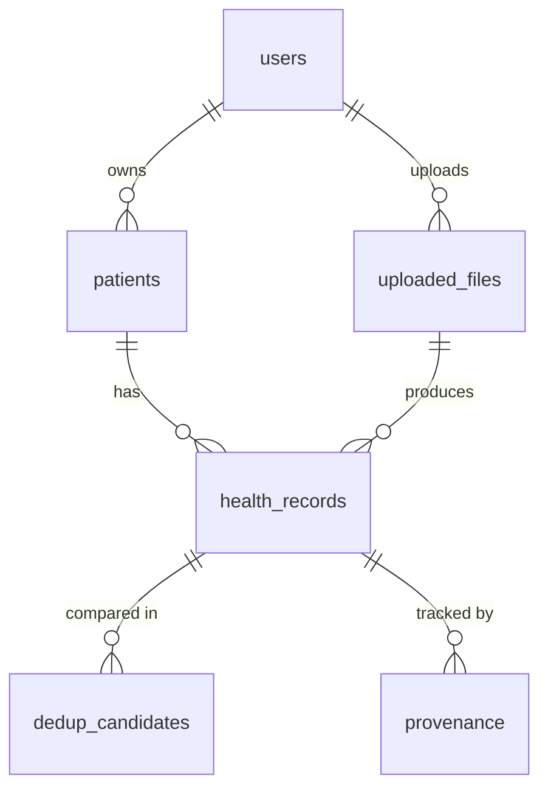

# Strand

**Every medical record you have, in any format, on one timeline — then out as a summary, a prompt, a FHIR export, or context for the AI of your choice.**

[](LICENSE)
[](#tests)
[](#quick-start-docker)


*Your records at a glance. All screenshots use synthetic [Synthea](https://synthetichealth.github.io/synthea/) data — no real records.*

Your medical history arrives scattered across formats and portals: a FHIR bundle from one system, an Epic EHI export from another, a CDA document from the hospital, a scanned PDF from the specialist who still faxes. Strand ingests all of it — structured exports and unstructured documents alike, reading scans and notes into structured records with optional AI — normalizes everything to FHIR R4, removes the duplicates that pile up across exports, and lays it out on one interactive timeline.

Then it's yours to use. Strand can write a summary, build a de-identified
prompt for another LLM, or export a standard FHIR bundle. AI is optional.
Cloud-assisted summaries and custom-local summaries receive best-effort
de-identified content. Cloud-assisted OCR is different: the selected vision
provider receives the original PDF or TIFF before Strand has text to scrub.
Prompt-only mode makes no model call. The optional strict-local path processes
raw documents on the validated Apple M4 profile; 16 GB is the minimum and
recommended memory. Strand organizes and moves records. It does not diagnose,
interpret, or give medical advice.

## A quick tour

| | |
|---|---|
|  |  |
| **In:** add records in any format — FHIR, Epic, CDA, or a scanned PDF. | **Organized:** everything on one timeline, de-duplicated and coded. |
|  |  |
| **Out:** a summary, a de-identified prompt or context bundle, or the stored records as a FHIR export. | A record opened up, with its values, coding, and source. |

## Quick start (Docker)

You need Docker (Desktop, or Engine + Compose).

```bash
git clone https://github.com/potalora/strand && cd strand
cp .env.docker.example .env
just gen-secrets            # or: bash scripts/gen-secrets.sh
docker compose up -d        # or: just up
```

Then open http://localhost:3000 (the API is at http://localhost:8000). For live AI features, add a provider key (Gemini, OpenAI, Anthropic, or OpenRouter) or point at a local Ollama or LM Studio model. Set this up at Admin → System → AI providers, or see [AI providers](#ai-providers). Prompt-only needs no key.

Everything binds to `127.0.0.1`, so nothing is reachable from outside your machine. On-device clinical extraction is off by default to keep the image small; rebuild with `--build-arg CLINICAL_NLP=true` to turn it on. The validated MLX pack is native-macOS only and is not available inside Docker Desktop. To upgrade, bump `APP_VERSION` in `.env` and run `docker compose pull && docker compose up -d`.

## What it does


```mermaid
flowchart LR
    I["Add records<br/><small>FHIR · Epic · CDA · PDF/scan</small>"]
    N["Normalize + dedup<br/><small>→ FHIR R4 records</small>"]
    S["One timeline<br/><small>on your machine</small>"]
    O["Take it out<br/><small>summary · prompt · FHIR · AI context</small>"]
    I --> N --> S --> O
```

Records go in as whatever you have. They come out as whatever you need.

## What goes in

Structured exports and unstructured documents go in the same way: Strand parses what it can, reads what it can't (scanned PDFs and notes) into structured records, codes them against standard vocabularies, de-duplicates against what you already have, and normalizes everything to FHIR R4.

| Format | File type | What it produces |
|--------|-----------|------------------|
| FHIR R4 bundle | `.json` | 18 resource types |
| Epic EHI Tables | `.zip` of `.tsv` | 14 table mappers → FHIR |
| CDA XML | `.xml` | ClinicalDocument → FHIR |
| IHE XDM | `.zip` | manifest → CDA docs → FHIR |
| Unstructured | `.pdf` `.rtf` `.tiff` | OCR → entity extraction → FHIR |

<details>
<summary>Epic EHI table mappers (14) and FHIR resource types (18)</summary>

**Epic TSV → FHIR:** PROBLEM_LIST / PROBLEM_LIST_ALL / MEDICAL_HX → Condition · PAT_ENC_DX → Condition (encounter dx) · ORDER_MED → MedicationRequest · ORDER_RESULTS → Observation · IP_FLWSHT_MEAS → Observation (vitals) · SOCIAL_HX → Observation (social) · PAT_ENC → Encounter · DOC_INFORMATION → DocumentReference · ALLERGY → AllergyIntolerance · IMMUNE → Immunization · ORDER_PROC → Procedure · REFERRAL → ServiceRequest · FAMILY_HX → FamilyMemberHistory

**FHIR resource types:** Condition, Observation, MedicationRequest, MedicationStatement, AllergyIntolerance, Procedure, Encounter, Immunization, DiagnosticReport, DocumentReference, ImagingStudy, ServiceRequest, CarePlan, Communication, Appointment, CareTeam, ImmunizationRecommendation, QuestionnaireResponse

</details>

## What comes out

Getting records out matters as much as getting them in. From your records you can produce:

- **A summary** — Strand writes it in the selected execution mode: validated local, custom local, or cloud assisted.
- **A copy-paste prompt** — a de-identified prompt, ready to run in any LLM, no API key needed.
- **A FHIR R4 bundle** — a standard export for any other app or system.
- **Scrubbed context** — the de-identified records themselves, to drop into the AI chat of your choice.

Prompt and context export do not call a model. Cloud-assisted and custom-local
summaries use the de-identification path. Validated strict-local ingestion keeps
document parsing and inference on the self-hosted machine. The backend decrypts
and rasterizes the upload locally; the model worker has an additional
OS-enforced network deny. Cloud-assisted PDF and TIFF ingestion sends the
original document or pages to the selected vision provider before OCR text is
available for scrubbing.

## Privacy and AI

- **AI is optional.** Prompt-only builds a de-identified payload and makes no model call.
- **Validated strict local is fail-closed.** Upload handling, decryption, rasterization, and inference stay on the self-hosted machine. The backend parsing step is local-only by application routing; the model worker also runs under an OS-enforced network-deny profile. A cross-process lock permits only one live model worker. The path branches before cloud-provider construction and never falls back. This prevents Strand's strict-local path from sending the document to a provider, but it is not a machine-wide data-loss-prevention boundary for the network-capable web process. The shipped Apple M4 16 GB pack passed its real-model, fidelity, privacy, and resource gates. It remains opt-in.
- **Custom local is unverified.** Custom-local summaries use loopback Ollama or LM Studio. Strand does not validate the server, model, or output quality.
- **Cloud-assisted OCR sends the original scan.** For PDF and TIFF ingestion, the selected vision provider receives the unredacted document or pages before OCR. The OCR text is scrubbed before downstream cloud extraction, and cloud-assisted summaries use scrubbed records. The scrubber covers structured patterns, known patient identifiers, and free-text names, but it is best-effort PII reduction rather than certified Safe Harbor de-identification.
- **No medical advice.** Strand organizes, summarizes, and exports records. It never generates diagnoses, interpretations, or treatment suggestions.
- **It runs on your machine.** The stack is self-hosted and binds to `127.0.0.1`, so nothing is exposed by default.
- **Known limits.** Recognized full dates are reduced to the year,
  but city and other location names may remain. Free-text name redaction depends
  on the configured spaCy PERSON model; if it is missing or fails to load, that
  pass fails open for the current call while the regex and known-patient filters
  still run.

The 9.02 GiB strict-local pack uses OvisOCR2 for page OCR, NuExtract3 for
grounded clinical extraction, and Qwen3.5-9B only for the final summary. On the
validated M4 16 GB profile, all reported fidelity rate metrics were 1.0. Peak
MLX allocations were about 0.86 GB for OCR, 4.73 GB for extraction, and 7.10 GB
for summarization. See
[Strict-local AI operations](docs/operations-strict-local-ai.md) for
installation and the benchmark- and fidelity-bound release evidence.

## AI providers

Configure the loopback provider for custom-local summaries and choose providers
for cloud-assisted tasks at **Admin → System → AI providers**. Enter a key or
local endpoint, choose a model, and test the connection. Stored keys are
encrypted.

| Provider | How to use | Runs |
|----------|------------|------|
| Google Gemini | API key | Cloud |
| OpenAI | API key | Cloud |
| Anthropic (Claude) | API key | Cloud |
| OpenRouter | API key | Cloud (aggregator) |
| Ollama | local server, no key | On your machine |
| LM Studio | local server, no key | On your machine |
| Vertex AI | Google Cloud project | Cloud |

Custom-local summary mode uses a loopback Ollama or LM Studio endpoint.
Cloud-assisted PDF and TIFF OCR sends the original document or pages to the
selected vision provider. If a cloud provider refuses or fails, Strand does not
send the document to another cloud provider. A loopback vision provider that
cannot read the document may fall back once to Gemini, which then receives the
original document. After OCR, downstream cloud extraction and summary calls
receive best-effort de-identified text or records. Ollama and LM Studio are
labelled `Custom local (unverified)`. Neither is treated as the validated
strict-local pack.

## How it works

### De-duplication

The same hypertension diagnosis can show up in an Epic export and again in a
CDA document with slightly different wording. Every upload starts with a
heuristic scan against existing records. Cloud-assisted dedup sends ambiguous
pairs to the configured LLM judge. All other modes leave those pairs for manual
review without loading provider configuration or calling a model.


```mermaid
flowchart TD
    N["New records"] --> H{"Heuristic<br/>score"}
    H -->|high| M["Merge"]
    H -->|borderline| C{"Cloud assisted?"}
    H -->|low| K["Keep both"]
    C -->|yes| J{"LLM<br/>judge"}
    C -->|no| R["You decide in Admin"]
    J -->|confident| M
    J -->|unsure| R["You decide in Admin"]
```

Scores of 0.95 or higher merge automatically. Scores from 0.60 through 0.94
go to the LLM judge only in cloud-assisted mode; otherwise they stay pending
for manual review. Lower scores are left alone. Every merge keeps the originals
and is reversible.

### Extraction from documents

A scanned note becomes structured records through OCR, entity extraction, and
FHIR mapping. Validated strict local uses page-at-a-time OvisOCR2 followed by
NuExtract3 schema and evidence validation. It fails if the local pack is
missing or invalid.

The older configurable extraction engine remains available as `gemini`,
`local`, or `hybrid`. Its `local` option is medspaCy and scispaCy clinical NLP,
not the validated model pack. `hybrid` may escalate uncertain sections to a
cloud provider, and a missing optional clinical-NLP install can fall back to
the cloud route. Choose validated strict local when no-fallback processing is
required.

### Coding and cleanup

As records come in, Strand attaches standard codes where it can: RxNorm for medications, ICD-10-CM for conditions, LOINC for common labs. The vocabularies are bundled and matched locally, so no terminology lookups leave your machine, and a fuzzy match (RapidFuzz, on a tight threshold) catches typos and brand/generic variants without risking a wrong code. Anything it doesn't recognize stays uncoded rather than guessed. Extraction also drops obvious noise before anything is stored — bare measurements, procedures only mentioned in passing, scrubber leftovers — so the timeline is made of real records, not fragments.

## Architecture and data


```mermaid
erDiagram
    users ||--o{ patients : owns
    users ||--o{ uploaded_files : uploads
    patients ||--o{ health_records : has
    uploaded_files ||--o{ health_records : produces
    health_records ||--o{ dedup_candidates : "compared in"
    health_records ||--o{ provenance : "tracked by"
```

`health_records` is the core table: every clinical fact, stored as an encrypted
FHIR R4 payload. Patient identifiers, account email, uploaded source files,
extracted text and entities, prompts, summaries, strict-local checkpoints, and
evidence are encrypted at rest with app-layer AES-256-GCM. Some operational and
search metadata remains plaintext by design. UUID primary keys are used
throughout. Nothing is hard-deleted: `deleted_at` marks a row gone, and deleting
an upload cascades that soft-delete to the records it produced. Full schema
lives in the Alembic migrations.

## Configuration

Copy `.env.docker.example` to `.env` and run `just gen-secrets` to fill the required secrets (`DB_PASSWORD`, `JWT_SECRET_KEY`, `DATABASE_ENCRYPTION_KEY`). Provider keys are optional. Add one in the app or environment only for custom/cloud live modes. The optional Apple MLX runtime uses `just local-ai-runtime-install`; model download remains a separate explicit action. See `.env.example` and [Strict-local AI operations](docs/operations-strict-local-ai.md).

## Develop

`just` wraps the dev loop. `just setup` provisions the toolchain (uv for the backend, npm for the frontend) and brings up Postgres and Redis in Docker; `just dev` runs both servers with reload; `just test` runs the suites.

<details>
<summary>Native setup without Docker (macOS)</summary>

```bash
brew services start postgresql@16 && brew services start redis
createdb strand && createdb strand_test
psql strand < scripts/init-db.sql
psql strand_test -c "CREATE EXTENSION IF NOT EXISTS pgcrypto;"

cd backend && uv sync && uv run python -m spacy download en_core_web_md
uv run alembic upgrade head
uv run uvicorn app.main:app --reload --port 8000

cd frontend && npm install && npm run dev
```

</details>

## Tests

```bash
cd backend
uv run pytest -m "not slow"     # fast suite
uv run pytest                    # everything (slow tests call a live AI provider)
uv run pytest tests/fidelity/    # real-data fidelity (skips without fixtures)
uv run pytest -m "local_model or hardware"  # release machine only
```

The fast suite runs against `strand_test` (auto-derived from `DATABASE_URL`). Fidelity tests need real-data fixtures and skip when they're absent; point `REAL_MEDICAL_FIXTURES_DIR` at a local corpus to run them.

## API

Full contract: [`docs/backend-handoff.md`](docs/backend-handoff.md) (base URL `/api/v1`).

| Group | Endpoints |
|-------|-----------|
| **Auth** | `register` `login` `refresh` `logout` `me` |
| **Records** | `GET /records` · `/records/:id` · `/records/:id/linked` · `/search` · `/series` · `/export` |
| **Timeline** | `GET /timeline` |
| **Upload** | `POST /upload` · `/upload/unstructured` · status + review endpoints |
| **Dedup** | `/dedup/candidates` · `/merge` · `/dismiss` |
| **Summary & export** | `/summary/build-prompt` · `/generate` · `/paste-response` · `GET /records/export` |
| **Local AI** | `/local-ai/status` · pack operations · job status/cancel · `/records/:id/evidence` |

## Security and HIPAA-informed controls

| Authentication | Data protection | Monitoring |
|----------------|-----------------|------------|
| bcrypt (cost 12+) | AES-256-GCM on clinical payloads and source files | Audit log on all data endpoints |
| JWT 15-min access tokens | Best-effort PHI scrub for downstream AI payloads | Rate limiting |
| 7-day refresh tokens (rotated) | Soft delete only | Account lockout (5 fails) |
| Token revocation (JTI) | User-scoped queries | 30-min idle timeout |
| Password complexity | UUID upload filenames | CORS hardening |

**What's encrypted at rest.** App-layer AES-256-GCM covers patient identifiers,
account email, clinical FHIR payloads, uploaded source files, extracted
text/entities, prompts, summaries, strict-local checkpoints, and evidence.
Operational fields needed for indexing, filtering, audit, and job control are
not all encrypted. Full-disk encryption (FileVault, LUKS, or BitLocker) is
still recommended because plaintext exists in process memory and temporary
owner-only scratch while a document is processed.

These are HIPAA-informed security controls, not a certification. HIPAA compliance is an organizational state — risk analysis, business associate agreements, a trained workforce, audited policies — not a property of code, and a single-user, self-hosted instance is not a covered entity in the first place. The controls here describe the safeguards in the code, not a certification of compliance, and the operator is responsible for any compliance obligations that attach to their use.

## Tech stack

**Backend** — Python 3.11 / FastAPI / SQLAlchemy 2 async / PostgreSQL 16 / Alembic / LangExtract / spaCy / RapidFuzz / `fhir.resources`. Pluggable LLM layer over the Gemini, OpenAI, and Anthropic SDKs (one OpenAI-compatible client also covers OpenRouter, Ollama, and LM Studio). Optional `clinical-nlp` adds scispaCy + medspaCy. The strict-local Apple worker is a separate locked MLX environment so it does not enter the backend dependency graph.

**Frontend** — Next.js / TypeScript / Tailwind CSS / shadcn/ui / TanStack Query / Zustand. Custom JWT auth with transparent refresh.

**Infra** — PostgreSQL 16 + Redis 7, via Docker Compose or Homebrew. Container images published to GHCR (`:edge` on every merge, `:vX.Y.Z` on release tags).

## License

[MIT](LICENSE)
